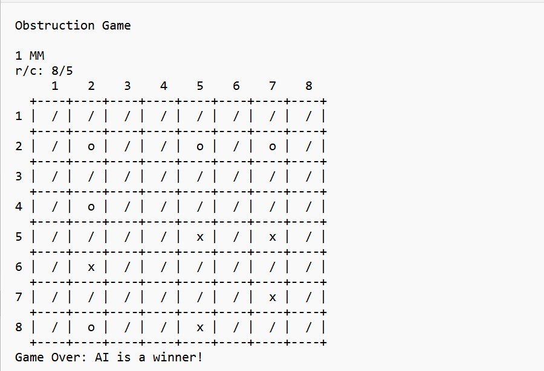

# Obstruction-Game
Obstruction Game (class homework) - 
The game is played on a grid maximum 8 x 8 size or any combination from 3 to 8. 
One player is 'O' and the other is 'X'. The players take turns in writing their symbol in an empty cell placing a shade around the selected symbol on the neighboring cells. 
A person who cannot make obstruction loses the game.
a user selects who starts a game first - either the user or AI player
the program is using Minimax and Alpha Beta Pruning algorithms. Technologies used: Python

